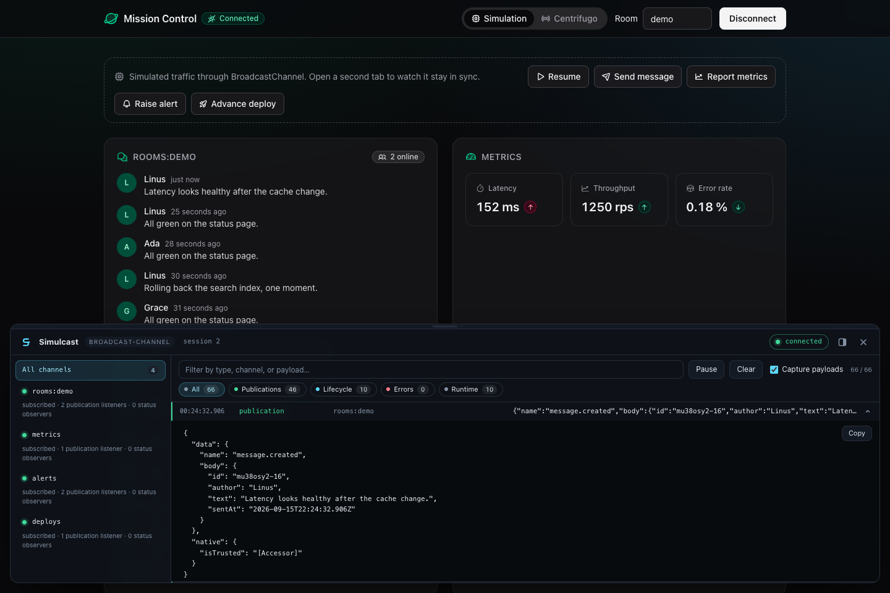

# Simulcast

**Typed realtime subscriptions for React, Vue, Solid, Svelte, and TypeScript.**

Share one native subscription across consumers, replace connection sessions when
accounts change, and inspect events with browser devtools. Eleven adapters connect
the runtime to hosted providers, self-hosted servers, and browser transports.

[Get started](docs/getting-started.md) · [Adapters](docs/adapters.md) ·
[Examples](docs/examples.md) · [Devtools](docs/devtools.md) · [Documentation](docs/README.md) · [GitHub](https://github.com/priemskiyyy/simulcast)

## Why Simulcast?

- **Shared subscriptions.** Multiple components listening to the same channel use
  one native subscription. The last publication consumer releases it.
- **Explicit sessions.** Replacing a session reconnects active consumers. Cleanup
  from an old session cannot disconnect its replacement.
- **Typed publications.** Infer payload types from parsers, declare event maps,
  and optionally generate named framework hooks.
- **Framework bindings.** Use React hooks, Vue composables, Solid primitives,
  Svelte utilities, or the observable core directly.
- **Provider APIs stay accessible.** Shared native clients and publication context
  preserve access to provider-specific functionality where the adapter exposes it.
- **Browser inspection.** See channel state, listener counts, errors, and event
  history without creating subscription demand.

## Try it without a server

```sh
pnpm add simulcast simulcast-broadcast-channel
```

```ts
import { RealtimeClient } from "simulcast";
import { broadcastChannel } from "simulcast-broadcast-channel";

const realtime = new RealtimeClient({
  adapter: broadcastChannel({ prefix: "app:" }),
});

const disconnect = realtime.connect();
const unsubscribe = realtime.channel("rooms:demo").subscribe((publication) => {
  console.log(publication.data);
});

const publisher = new BroadcastChannel("app:rooms:demo");
publisher.postMessage({ text: "Hello, room" });

// When the application is done listening:
// unsubscribe();
// disconnect();
// publisher.close();
```

Run this in a browser or a runtime that supports BroadcastChannel. The complete
[React walkthrough](docs/getting-started.md) adds a provider, a message list, and a
send button. Simulcast manages subscriptions; publishing uses your transport's API.

## Packages

| Package                                   | Purpose                                          |
| ----------------------------------------- | ------------------------------------------------ |
| [`simulcast`](packages/core)              | Framework-independent runtime and mock adapter   |
| [`simulcast-react`](packages/react)       | React and React Native bindings                  |
| [`simulcast-vue`](packages/vue)           | Vue composables                                  |
| [`simulcast-solid`](packages/solid)       | Solid primitives                                 |
| [`simulcast-svelte`](packages/svelte)     | Svelte utilities                                 |
| [`simulcast-devtools`](packages/devtools) | Browser inspector and framework wrappers         |
| [`simulcast-codegen`](packages/codegen)   | Event-hook generation from TypeScript event maps |

### Adapters

| Provider           | Package                                                              | Channel semantics                    |
| ------------------ | -------------------------------------------------------------------- | ------------------------------------ |
| Centrifugo         | [`simulcast-centrifugo`](packages/adapters/centrifugo)               | Subscription channel                 |
| Pusher Channels    | [`simulcast-pusher`](packages/adapters/pusher)                       | Public, private, or presence channel |
| Ably               | [`simulcast-ably`](packages/adapters/ably)                           | Realtime channel                     |
| Supabase Realtime  | [`simulcast-supabase`](packages/adapters/supabase)                   | Broadcast topic                      |
| Socket.IO          | [`simulcast-socketio`](packages/adapters/socketio)                   | Event name                           |
| Phoenix Channels   | [`simulcast-phoenix`](packages/adapters/phoenix)                     | Channel topic                        |
| MQTT               | [`simulcast-mqtt`](packages/adapters/mqtt)                           | Topic filter                         |
| PartyKit           | [`simulcast-partykit`](packages/adapters/partykit)                   | Room                                 |
| WebSocket          | [`simulcast-websocket`](packages/adapters/websocket)                 | Your protocol's channel identifier   |
| Server-Sent Events | [`simulcast-sse`](packages/adapters/sse)                             | One EventSource URL                  |
| BroadcastChannel   | [`simulcast-broadcast-channel`](packages/adapters/broadcast-channel) | Same-origin channel name             |

Adapters preserve provider-specific authentication, payload formats, and recovery
behavior. See [installation](docs/installation.md) for SDK dependencies and
[adapter setup](docs/adapters.md) for the exact mappings.

## See what happened



The inspector works with React, Vue, Solid, Svelte, and plain TypeScript. Payload
capture is opt-in; recording is bounded. [Devtools guide](docs/devtools.md).

## Run the examples

```sh
pnpm install --frozen-lockfile
pnpm build
pnpm generate:hooks
pnpm --filter example-react dev
```

The Mission Control dashboard also runs in Vue, Solid, Svelte, and Expo. Simulation
mode needs no backend or credentials. [Example guide](docs/examples.md).

## Development and verification

Use Node 22.18 or newer and the pnpm version declared in `package.json`.

```sh
pnpm check
pnpm build:docs
```

`pnpm check` builds packages and examples, checks types, lint and formatting, runs
unit and local provider tests, and validates generated hooks. Browser tests use a
Centrifugo container. Packed-package checks install the distributable packages in
an isolated consumer. Test scope and prerequisites are documented in
[CONTRIBUTING.md](CONTRIBUTING.md) and [the provider suites](docs/integration-testing.md).

For release procedures, see [RELEASING.md](RELEASING.md).

## License

[MIT](LICENSE)
